# JISO — JSON ISO8583 Client & Mock Server Tool

<p align="center">
  
</p>

JISO is a feature-rich command-line tool for simulating, testing, and debugging ISO8583 payment message flows. It connects to ISO8583 servers, composes and sends transactions from JSON templates, runs multi-step test scenarios, stress-tests payment switches, hosts an embedded mock server, and reverse-engineers PCAP traffic captures — all from a single binary.

## Features

- **Full-screen TUI** (`jiso tui`) with command palette, page map, and live worker views ([docs/tui.md](docs/tui.md))
- **Polymorphic JSON configuration** — define `transaction`, `dataset`, `scenario`, and `mock_route` items in one file
- **Dynamic target switching** at runtime (`target`, `set ip`, `set port`) with auto-reconnect
- **Specification hot-swapping** (`spec`) and transaction file reloading (`tx`, `reload`)
- **Multi-step Scenario Engine** with context memory extraction (`{{context.X}}`), dataset interpolation (`{{data.X}}`), and response validation (exact, regex, exists)
- **Embedded ISO8583 Mock Server** with route matching, echo fields, auto-generated auth codes, configurable latency/jitter, required-field validation, and `drop_connection` chaos testing
- **Unsolicited message handling** — connect with `mock_routes` to auto-respond to incoming server-initiated messages
- **PCAP & TCP stream traffic analyzer** with flow aggregation, variance analysis, and auto-generation of transaction templates or mock server routes
- **Stress testing** with gradual TPS ramp-up, concurrent workers, and comprehensive summary reports (latency percentiles, response code breakdown, latency budget, histograms)
- **Background workers** (`bgsend`) with interval-based continuous sending, circuit breakers, and health-check gating
- **Boilerplate generators** (`init-spec`, `init-tx`) compiled into the binary via `//go:embed`
- **SQLite session logging** for transaction history and analytics (`--db`, `db stats`)
- **VISA Base I header support** with station-ID management and session control
- **Mutual TLS (mTLS) Zero-Trust Security & Visa SMC Support** — consolidated JSON TLS configuration (`--tls-config`), strict PEM certificate validation, client/server mTLS authentication, interactive test certificate generator (`scripts/gen-test-certs.sh`), and automated Visa 0800 echo keep-alive heartbeat (see [TLS Guide](docs/tls.md))
- **Hex dump mode** (`-hex`) for byte-level message inspection
- **Structured test reports** — ANSI-colored terminal trees and JSON export (`--report`) for CI/CD pipelines
- **Automatic field generation** — STAN, RRN, Auth Code, date/time fields populated at runtime
- **Per-transaction specification override** (`"spec"` key) for multi-network testing
- **Composite field support** — positional, TLV, BER-TLV/EMV, and bitmap-governed composites

---

## Table of Contents

- [Features](#features)
- [Documentation Index](#documentation-index)
- [Installation](#installation)
  - [Prerequisites](#prerequisites)
  - [Building from Source](#building-from-source)
  - [Running without Building](#running-without-building)
- [Quick Start](#quick-start)
- [TUI Screens (page map)](#tui-screens-page-map)
- [Command-Line Interface](#command-line-interface)
  - [Command Tree](#command-tree)
  - [Standard Flags](#standard-flags)
  - [Environment Variables & Precedence](#environment-variables--precedence)
  - [Configuration File (XDG)](#configuration-file-xdg)
  - [Exit Codes](#exit-codes)
  - [Shell Completion](#shell-completion)
  - [Examples](#examples)
- [REPL Removal (v2.0.0)](#repl-removal-v200)
- [Transaction & Payload Configuration](#transaction-configuration)
- [Traffic Analyzer (`analyze` / `pcap`)](#traffic-analyzer-analyze--pcap)
- [Stress Testing](#stress-testing)
- [Mutual TLS (mTLS) & Visa SMC Security](#mutual-tls-mtls--visa-smc-security)
- [Connection Types](#connection-types)
- [Unsolicited Message Handling](#unsolicited-message-handling)
- [Session Database](#session-database)
- [Robust Networking](#robust-networking)
- [ISO8583 Specification Files](#iso8583-specification-files)
- [Project Structure](#project-structure)
- [Testing](#testing)
- [Troubleshooting](#troubleshooting)

---

## Documentation Index

The [`docs/`](docs/) directory contains detailed technical guides and specifications:

| Document | Description |
| :--- | :--- |
| 🛡️ [**Mutual TLS & Visa SMC Guide**](docs/tls.md) | Zero-trust mTLS setup, consolidated `tls_config.json`, interactive certificate generator script (`scripts/gen-test-certs.sh`), client/server mTLS usage, and Visa 0800 echo keep-alive daemon. |
| 📋 [**Polymorphic JSON Schema**](docs/SCHEMA.md) | Complete schema specification for unified `transaction`, `dataset`, `scenario`, and `mock_route` definitions. |
| 🔄 [**Scenario Engine Specification**](docs/scenarios.md) | Multi-step transaction workflow definition, context memory extraction (`{{context.X}}`), and response assertion rules. |
| ⚙️ [**ISO8583 Specification Format**](docs/specifications.md) | ISO8583 message layout encoding guide (ASCII, BCD, Hex, Binary, EBCDIC) and composite field definitions. |
| 🖥️ [**TUI User Guide**](docs/tui.md) | Full-screen `jiso tui` guide: page map, key registry (pinned to the live help overlay), command palette, confirms, masking contract. |

---

## Installation

### Prerequisites

- Go 1.18 or higher
- Make (optional, for using Makefile commands)

### Building from Source

```bash
git clone https://github.com/Andrei-cloud/jiso.git
cd jiso
make build
```

The binary is written to `bin/jiso`. To build for Linux from macOS:

```bash
make build-linux
```

### Running without Building

```bash
go run ./cmd/main.go
```

---

## Quick Start

### 1. Generate Default Configuration Files

If starting from scratch, generate the default specification and transaction files:

```bash
# Generate a default ISO8583 specification
jiso spec init

# Generate a comprehensive sample transaction configuration
# (includes transaction templates, datasets, scenarios, and mock routes)
jiso tx init
```

These write to `./specs/spec.json` and `./transactions/transaction.json` respectively. You can pass a custom output path:

```bash
jiso spec init ./specs/my_custom_spec.json
jiso tx init   ./transactions/my_transactions.json
```

### 2. Start the Interactive TUI

```bash
jiso tui
```

> Bare `jiso` prints a usage hint and exits 0; interactive mode is only entered explicitly — [`jiso tui`](docs/tui.md) opens the full-screen TUI (the line-oriented REPL was removed in v2.0.0).

### 3. Configure Target, Specification, and Transactions

Pass `--host`/`-H`, `--port`/`-p`, `--spec`/`-s`, and `--file`/`-f` at launch
(or set the `JISO_*` environment variables), or edit them live on the TUI
Settings page (open the palette with `:`), where `w` persists user defaults.

### 4. Connect and Send

Press `c` in the TUI to open the connect dialog (connection mode and length
header selection), then send a loaded transaction from the Transactions page
(`2`; select a row and press `s` for the request/response exchange view).

---

## TUI Screens (page map)

`jiso tui` is a full-screen page-stack router. Hotkeys `1`–`8` jump to a screen;
the remaining pages open from the command palette (`:`) or by drilling in. The
authoritative, always-current version (every key, generated from the live help
registry) is [docs/tui.md](docs/tui.md).

| Hotkey | Screen | Contents |
|---|---|---|
| `1` | **Dashboard** (§A) | Connection / server / session cards, last send & stress cards, quick actions, server log |
| `2` | **Transactions** (§B) | Tx table from the loaded tx file, filter and sort; `f` picks a file and a rejected load names its reason |
| `3` | **Message Inspector** (§C) | Fields tree, bitmap, packed hex, raw JSON tabs (opened by `enter` on a tx) |
| `4` | **Mock Server** (§G) | Serve stats, route table, live SERVER LOG, start form |
| `5` | **Workers & Stress** (§H) | Worker table, TPS sparkline, per-worker progress |
| `6` | **Sessions** (§I) | Session list, stats, tx history, per-tx review |
| `7` | **PCAP Analyze** (§J) | 4-step wizard (capture / spec / header / run), per-direction flow table, generated-item picker, unparsable reviewer |
| `8` | **Help** (§M) | Full key registry as a page (same content as the `?` overlay) |
| — | **Scenarios** (§F) | Scenario list, live step stream, report export |
| — | **CTF Export** (§K) | Visa-eligible sessions, CTF parameters, file preview |
| — | **Settings** (§L) | Live config editor, `w` persists user defaults |
| — | **Send exchange** (§D) | Deep page opened by `s` on Transactions: request/response split |

Root-owned overlays (never pages in the stack): the connect dialog (§E), command
palette, help overlay, file picker, the §N2 start wizards, and §N3 confirms.

---

## User journeys (in action)

A guided tour of the full-screen TUI (`jiso tui`). Every capture below is a real
session — a JISO client driving JISO's own embedded mock server on
`127.0.0.1:9999`.

### 1 · Connect a client and send a transaction

Press `c` for the connect dialog (mode, TCP length header, target), pick a loaded
transaction on the Transactions page, and send it. The request and the server's
response render side by side while JISO connects, sends, receives, parses,
validates, and correlates the STAN — green `echo` marks flag every field the mock
server echoed back.

<table>
<tr>
<td align="center" width="33%"><b>Connect dialog</b><br>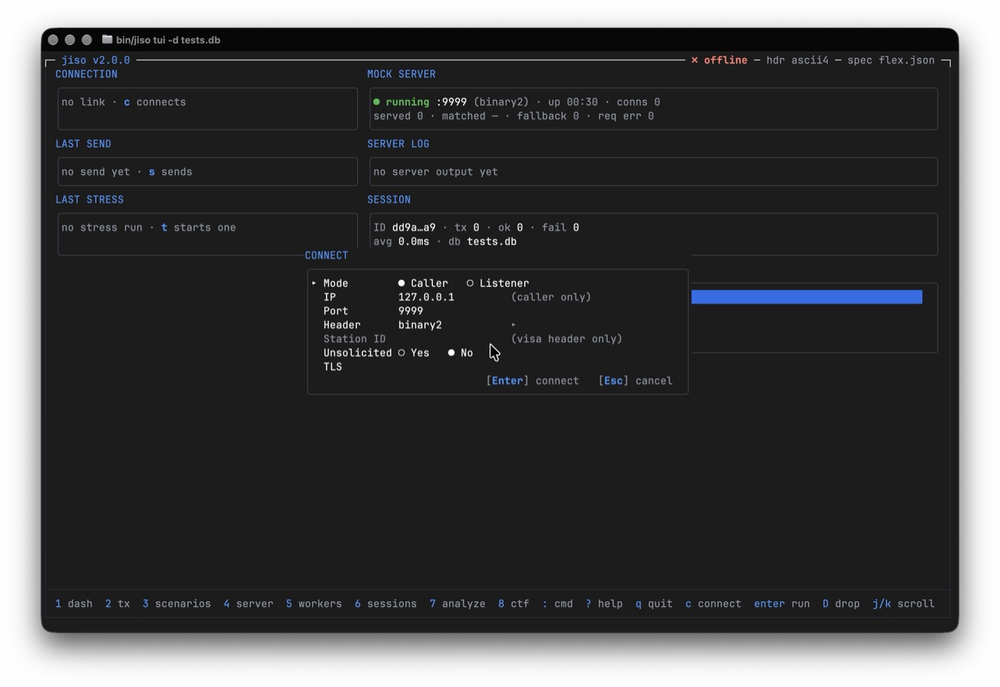</td>
<td align="center" width="33%"><b>Pick a transaction</b><br>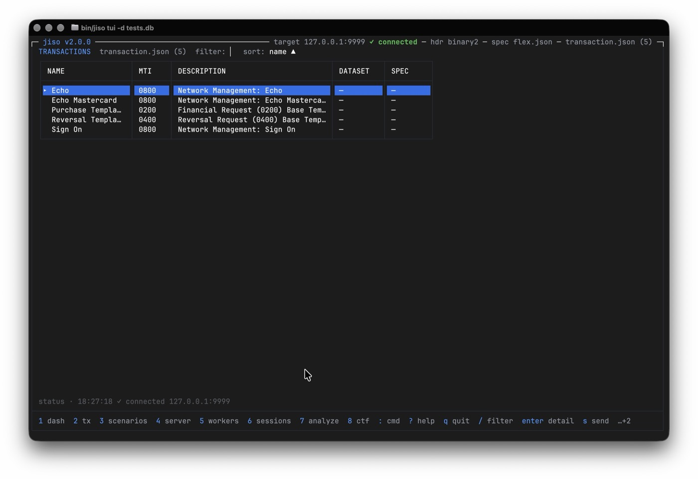</td>
<td align="center" width="33%"><b>Request / response</b><br>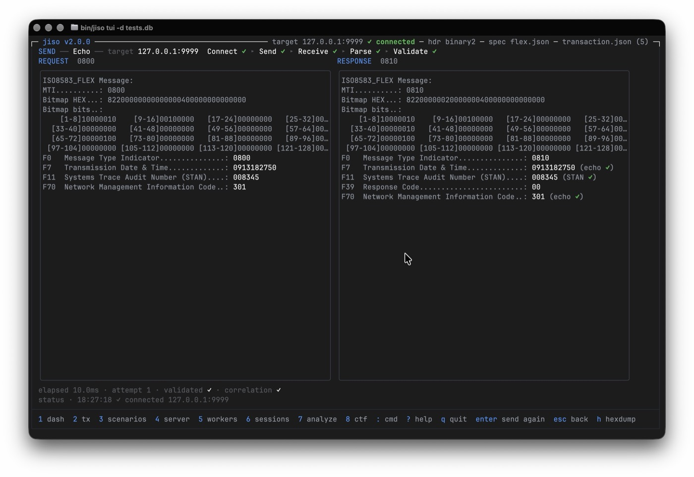</td>
</tr>
</table>

### 2 · Host the embedded mock server

`4` opens the mock-server page and `c` starts it on a port and length header with
a spec and a routes file. Watch it match and answer live requests in the SERVER
LOG, with served / matched / fallback / error counters and a per-route hit table.

<table>
<tr>
<td align="center" width="50%"><b>Configure &amp; start</b><br>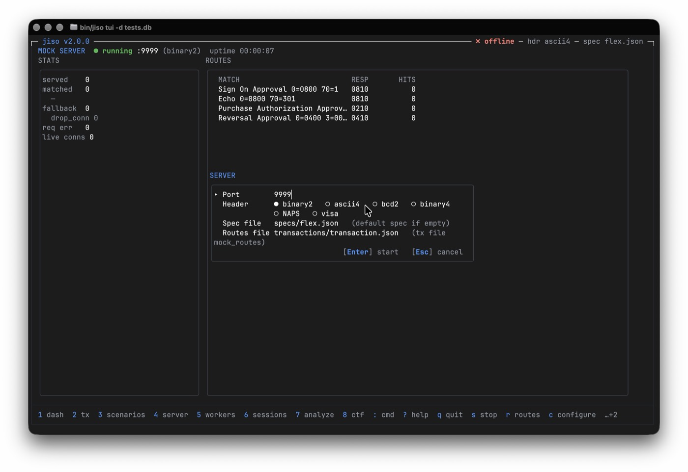</td>
<td align="center" width="50%"><b>Serving live traffic</b><br>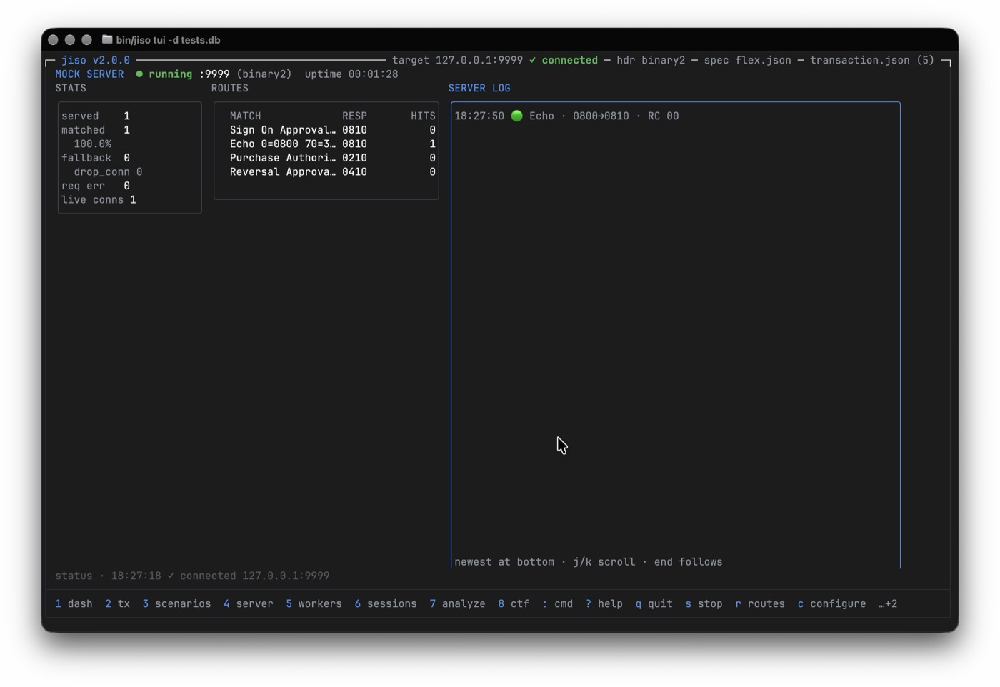</td>
</tr>
</table>

### 3 · Inspect a composed transaction

Open any recorded transaction for a byte-level hex dump plus the parsed ISO8583
message — MTI, bitmap, and every field with its TLV and dataset subfields
expanded. Sensitive values such as the PAN stay masked.

<p align="center">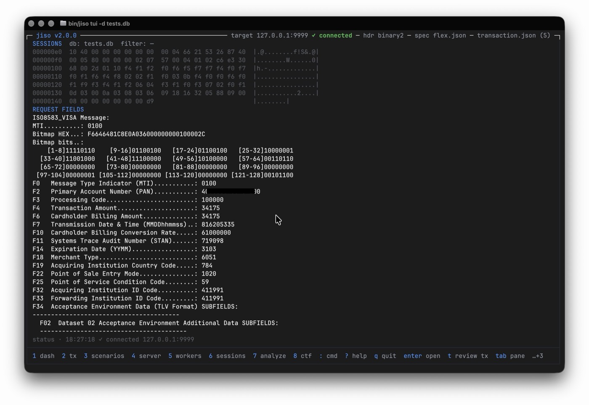</p>

### 4 · Stress test

Configure TPS, ramp, duration, and workers; run concurrent senders and watch the
live worker table, TPS sparkline, and progress bar. The summary reports latency
percentiles, a response-code breakdown, and a latency histogram.

<table>
<tr>
<td align="center" width="50%"><b>Live run</b><br>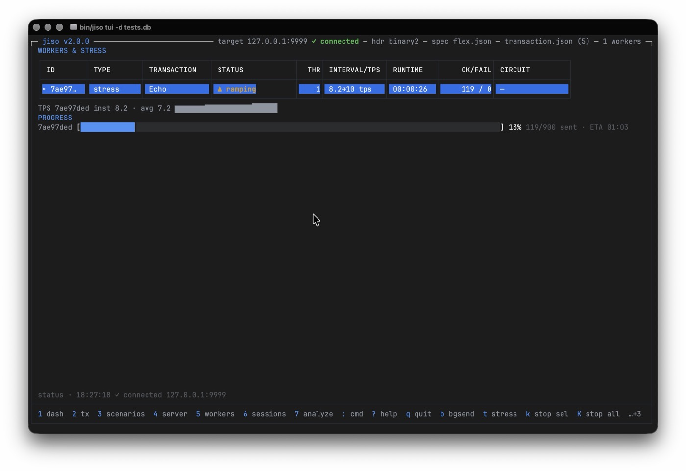</td>
<td align="center" width="50%"><b>Summary</b><br>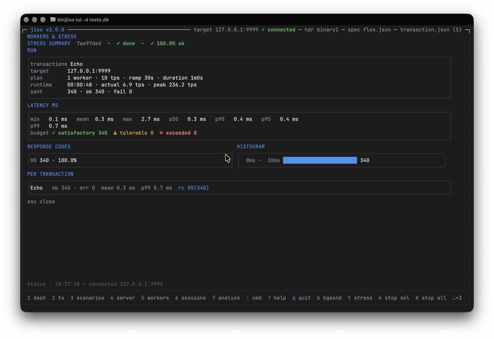</td>
</tr>
</table>

### 5 · Review recorded sessions

Launch with `--db` and every transaction is logged to SQLite. Browse sessions and
their per-transaction history — MTI, response code, latency — and drill into any
record.

<p align="center">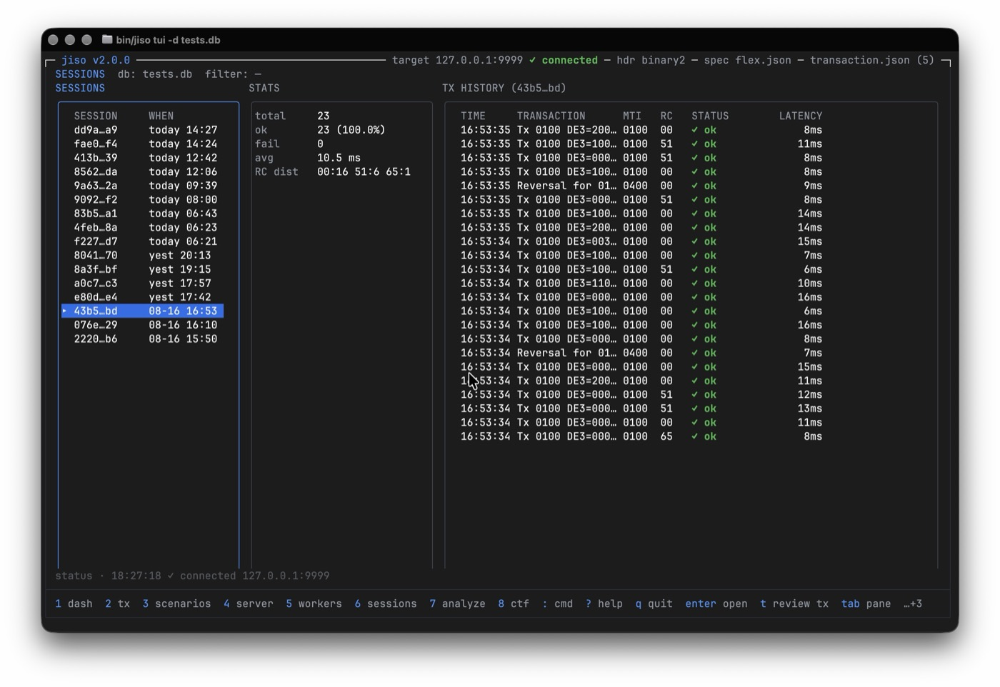</p>

### 6 · Analyze a PCAP capture

The four-step analyze wizard parses a raw capture, lets you choose which
direction to analyze, and previews the generated `transaction` and `dataset`
items — each stamped with the spec it was composed with — before you write them.

<p align="center">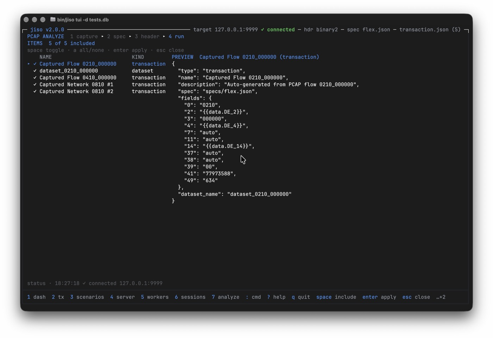</p>

### 7 · Export a Visa CTF clearing file

`8` exports approved Visa transactions from a recorded session into a Visa Base II
CTF file: pick the session and the interchange / filter / batch parameters, then
preview the fixed-column records before writing. Card numbers are masked below.

<p align="center"><b>Eligible sessions and parameters</b><br>
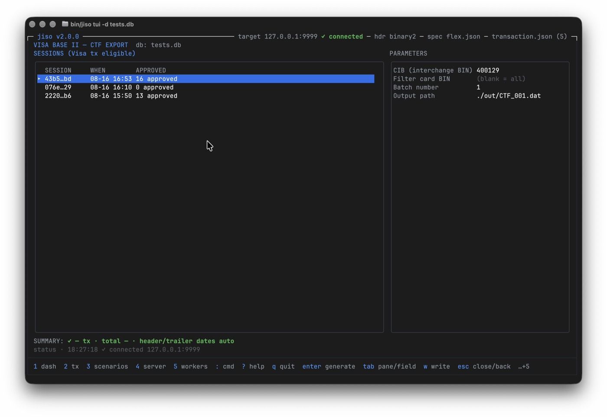</p>

<p align="center"><b>Generated CTF records</b><br>
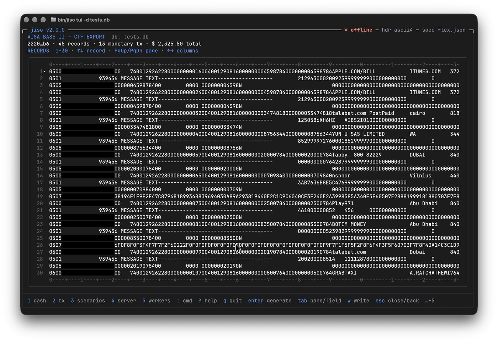</p>

---

## Command-Line Interface

JISO operates in two modes: **Direct CLI** (v2 Cobra command tree) for automation and CI/CD, and the **full-screen TUI** (`jiso tui`, see [docs/tui.md](docs/tui.md)) for exploratory testing. The legacy line-oriented REPL was removed in v2.0.0.

### Command Tree

Derived from `jiso --help` on the v2 branch:

| Command | Description |
|---|---|
| `jiso` | Naked invocation: prints a usage hint to stdout, exits 0 (no REPL drop-in) |
| `jiso repl` | Removed at v2.0.0: prints a removal notice to stderr and exits 2 (use `jiso tui`) |
| `jiso tui` | Launch the interactive Bubble Tea TUI (requires a TTY; without one prints a notice and exits 2 — see [docs/tui.md](docs/tui.md)) |
| `jiso spec init [path]` | Generate a default ISO8583 specification file |
| `jiso tx init [path]` | Generate a comprehensive sample transaction configuration file |
| `jiso connect check` | Probe target reachability, exit code reflects reachability (0 reachable, 1 unreachable, 2 host/port unset) |
| `jiso send <tx-name>` | One-shot connect, send, describe, and disconnect (`--wait=false` for fire-and-forget) |
| `jiso inspect [tx-name]` | Show composed message, packed hex, and parsed fields for a transaction |
| `jiso scenario list` | List all defined test scenarios |
| `jiso scenario run <name>` | Run a specific test scenario against a server (`-R/--report`, `-l/--length`) |
| `jiso server start [port] [headerType]` | Start embedded ISO8583 mock server in direct mode (alias `serve`) |
| `jiso server routes` | List active mock routes for server (alias `serve routes`) |
| `jiso stress` | Run a headless stress test against the target (`--tx`, `--tps`, `--ramp`, `--duration`, `--workers`, `-R/--report`) |
| `jiso analyze [pcap-file]` | Analyze stream/PCAP capture files to extract transaction templates & datasets (alias `pcap`) |
| `jiso ctf list` | List recorded sessions with Visa transactions eligible for CTF export (alias `clearing`) |
| `jiso ctf export` | Export approved Visa transactions from a session into a Base II CTF file |
| `jiso db stats [session-id\|list\|tx <id>]` | Show session transaction statistics and retrospective ISO 8583 message logs |
| `jiso completion <shell>` | Generate the autocompletion script for bash, zsh, fish, or powershell |
| `jiso version` | Print version information (alias `v`; also available as root `-v`) |

No command in the current tree is a stub; the placeholder path (`not implemented yet (planned: <ticket>)` on stderr, exit 2) stays reserved for future commands.

### Standard Flags

Persistent flags available on every command (from `jiso --help`):

| Flag | Default | Description |
|---|---|---|
| `--json` | `false` | Machine-readable JSON output on stdout (suppresses colors, banners, progress) |
| `-q, --quiet` | `false` | Suppress non-essential stdout notices |
| `-n, --dry-run` | `false` | Show what would happen; write/send nothing |
| `-v, --version` | — | Print version and exit 0 (root only; never means "verbose") |
| `-o, --output <path>` | `""` | Output file path on export commands (currently `ctf export`) |
| `-s, --spec <path>` | `""` | ISO8583 specification file path |
| `-f, --file <path>` | `""` | Transaction payload file path |
| `-d, --db <path>` | `""` | SQLite database file path |
| `-H, --host <addr>` | `""` | Target server host address |
| `-p, --port <port>` | `""` | Target server port |
| `--header <type>` | `""` | Message length header type (`ascii4`, `binary2`, `bcd2`, `binary4`, `NAPS`, `Visa`) |
| `-x, --hex` | `false` | Enable hex dump output for messages |
| `-r, --reconnect-attempts <n>` | `3` | Number of reconnection attempts on failure |
| `--connect-timeout <duration>` | `5s` | Timeout for individual connection attempts |
| `--total-connect-timeout <duration>` | `10s` | Total timeout for connection establishment |
| `--response-timeout <duration>` | `5s` | Timeout waiting for async message responses |
| `--listen-timeout <duration>` | `5m` | Timeout waiting for incoming client connections in listener mode |
| `--tls-config <path>` | `""` | Consolidated TLS/mTLS configuration JSON (see [TLS Guide](docs/tls.md)) |
| `--visa-station-id <id>` | `""` | VISA Local Station ID (6-digit hex or decimal) |

Output-format precedence is `--json` > `-q` > text. Debug output has no flag by design: use `$JISO_DEBUG=1` (extra diagnostics on stderr).

`jiso -v` (built via `make build`, which stamps version info with `-ldflags`):

```console
$ jiso -v
jiso version efe40e4
commit efe40e4
built at 2026-09-06T19:05:07Z
```

A plain `go build` without ldflags prints `dev` / `none` / `unknown` for these fields.

### Environment Variables & Precedence

Every standard setting can come from the environment:

| Env var | Equivalent flag |
|---|---|
| `JISO_SPEC` | `-s, --spec` |
| `JISO_FILE` | `-f, --file` |
| `JISO_DB` | `-d, --db` |
| `JISO_HOST` | `-H, --host` |
| `JISO_PORT` | `-p, --port` |
| `JISO_HEADER` | `--header` |
| `JISO_TLS_CONFIG` | `--tls-config` |
| `JISO_VISA_STATION_ID` | `--visa-station-id` |
| `JISO_JSON` | `--json` |
| `JISO_QUIET` | `-q, --quiet` |
| `JISO_DEBUG` | *(no flag — debug diagnostics on stderr)* |
| `JISO_UNSECURE` | `-u, --unsecure` (analyze: disable payload masking) |
| `JISO_CONFIG` | *(no flag — path to the user config file, `~` expanded)* |

**Precedence: `--flag` > `$JISO_*` env > user config file > built-in default.** A value set in a lower layer never overrides one set in a higher layer.

### Configuration File (XDG)

Persistent defaults live in `config.yaml` under the OS user-config directory:

- Linux (XDG): `$XDG_CONFIG_HOME/jiso/config.yaml` (default `~/.config/jiso/config.yaml`)
- macOS: `~/Library/Application Support/jiso/config.yaml`
- Override the location with `JISO_CONFIG=/path/to/config.yaml`

Keys mirror the lowercased env names; omit any key you do not need. A missing file is not an error; a malformed file exits 3 naming the path.

```yaml
# ~/.config/jiso/config.yaml
spec: ./specs/spec.json
file: ./transactions/transaction.json
host: 127.0.0.1
port: "9999"
header: ascii4
quiet: false
```

### Exit Codes

| Code | Meaning | Example trigger |
|---|---|---|
| `0` | Success | `jiso --help`, `jiso scenario list ...` |
| `1` | Generic error | runtime failures (e.g. `db stats` without a usable database) |
| `2` | Usage / flag error | unknown flag (`--bogus`), missing required argument, `jiso tui` without a TTY |
| `3` | Config / file-load error | `--spec nope.json` (spec file missing or unparseable) |
| `4` | Test failure | `jiso scenario run` with one or more failed steps |
| `130` | SIGINT (128+2) | Ctrl+C during a run |

`--help` and `-h` print to stdout and exit 0 (safe to pipe into a pager). Warnings, errors, and progress go to stderr; only results go to stdout.

### Shell Completion

```bash
# bash
jiso completion bash > /etc/bash_completion.d/jiso        # or: source <(jiso completion bash)

# zsh (a directory on $fpath)
jiso completion zsh > "${fpath[1]}/_jiso"

# fish
jiso completion fish > ~/.config/fish/completions/jiso.fish
```

### Examples

```bash
# Inspect a composed transaction as JSON, piped to jq
jiso inspect "Sign On" -s specs/spec.json -f transactions/transaction.json --json | jq '.mti, .packed_hex'

# Preview a scenario without connecting or sending anything
jiso scenario run "E2E Purchase and Reversal" -s specs/spec.json -f transactions/transaction.json --dry-run

# Session database statistics as JSON
jiso db stats -d ./sessions.db --json
```

---

## REPL Removal (v2.0.0)

The line-oriented interactive REPL was removed in v2.0.0 (standing plan:
the sunset notice shipped in REL-602, the loop is deleted in REL-604).
`jiso repl` now prints
`REPL was removed in v2.0.0 — use 'jiso tui' or the v2 command tree`
to stderr and exits 2; `-q` suppresses the notice (the exit code stays).

Every capability the REPL offered lives on in the v2 command tree (see
[Command Tree](#command-tree)) and in the full-screen TUI
([`jiso tui`, see docs/tui.md](docs/tui.md)):

| REPL command | v2 replacement |
|---|---|
| `connect` / `disconnect` | `jiso connect check` (reachability probe), `jiso send` (one-shot connect+send+disconnect); TUI connect dialog (`c`) |
| `send` / `bgsend` / `stress` | `jiso send <tx>`, `jiso stress --tx <tx> ...` |
| `info <tx>` | `jiso inspect <tx>` |
| `list` | `jiso tx list` / Transactions page (`2`) in the TUI |
| `scenarios` / `run-scenario` | `jiso scenario list` / `jiso scenario run <name>` |
| `serve ...` | `jiso serve start|stop|stats|routes` |
| `dbstats` | `jiso db stats [session-id]`, `jiso db tx <id>` |
| `analyze` | `jiso analyze` (headless, `--yes`/modes/`-o` report) |
| `ctf` | `jiso ctf list` / `jiso ctf export` |
| `target` / `spec` / `tx` | `--host`/`--port`, `--spec`, `--file` flags or `JISO_*` env vars |
| `stats` / `stop` / `stop-all` | `jiso stress` summary output; Workers & Stress page (`4`) in the TUI |
| `help` / `version` | `jiso --help`, `jiso version` |

---

## Transaction Configuration

All configuration items — transactions, datasets, scenarios, and mock routes — live in a single flat JSON array file. Each item declares a `"type"` discriminator.

> **See also:** [docs/SCHEMA.md](docs/SCHEMA.md) for the complete schema reference.

### Transaction Definition (`"type": "transaction"`)

```json
{
  "type": "transaction",
  "name": "Sign On",
  "description": "Network Management: Sign On (0800)",
  "fields": {
    "0": "0800",
    "7": "auto",
    "11": "auto",
    "37": "auto",
    "70": 1
  }
}
```

#### Autogenerated Field Keywords

Field values can use reserved keywords for dynamic runtime value generation:

| Keyword | Aliases | Generated Value |
|---|---|---|
| `"auto"` | `"$auto"` | Context-aware auto-population: DE 7 = timestamp, DE 11 = STAN, DE 12 = local time, DE 13/15/17 = local date, DE 37 = RRN, DE 38 = auth code |
| `"STAN"` | `"$STAN"`, `"stan"` | Atomic thread-safe 6-digit System Trace Audit Number (cyclic, persisted) |
| `"RRN"` | `"$RRN"` | 12-digit Retrieval Reference Number (cyclic, persisted) |
| `"auth_code"` | `"$auth_code"` | Random 6-character authorization code |
| `"datetime"` | `"$datetime"` | MMDDhhmmss transmission timestamp |
| `"date"` | — | MMDD current date |
| `"time"` | — | hhmmss current time |
| `"random"` | — | Randomly selected value from the linked dataset |

#### Per-Transaction Specification Override

Transactions can override the global specification by including a `"spec"` key pointing to a different spec file:

```json
{
  "type": "transaction",
  "name": "Echo Mastercard",
  "description": "Network Management: Echo Mastercard",
  "spec": "specs/mastercard.json",
  "fields": { ... }
}
```

#### Dataset Interpolation

Transactions can reference a named dataset for dynamic field values:

```json
{
  "type": "transaction",
  "name": "Purchase Template",
  "dataset_name": "card_pool",
  "fields": {
    "0": "0200",
    "2": "{{data.2}}",
    "14": "{{data.14}}",
    "35": "{{data.35}}"
  }
}
```

Placeholders matching `{{data.X}}` are replaced at runtime with values from a randomly selected entry in the named dataset.

### Dataset Definition (`"type": "dataset"`)

```json
{
  "type": "dataset",
  "name": "card_pool",
  "description": "Sample card data pool for testing scenarios",
  "data": [
    {
      "2": "1234567890123456",
      "14": "2512",
      "23": "001",
      "35": "1234567890123456=2512123"
    },
    {
      "2": "9876543210987654",
      "14": "2601",
      "23": "002",
      "35": "9876543210987654=2601123"
    }
  ]
}
```

### Scenario Definition (`"type": "scenario"`)

Scenarios define multi-step transaction flows with state persistence across steps.

> **See also:** [docs/scenarios.md](docs/scenarios.md) for the full scenario testing documentation.

```json
{
  "type": "scenario",
  "name": "E2E Purchase and Reversal",
  "description": "Sign On -> Purchase (extract AuthId) -> Reversal (use AuthId)",
  "dataset_name": "card_pool",
  "steps": [
    {
      "name": "Network Sign On",
      "use_transaction_id": "Sign On",
      "validate": [
        { "field": "39", "expect": "00" }
      ]
    },
    {
      "name": "Purchase Authorization",
      "use_transaction_id": "Purchase Template",
      "fields": { "4": "2500" },
      "extract": {
        "AuthId": "38",
        "OrigMTI": "0",
        "OrigSTAN": "11",
        "OrigDateTime": "7"
      },
      "validate": [
        { "field": "39", "expect": "00" },
        { "field": "38", "exists": true }
      ]
    },
    {
      "name": "Reversal of Purchase",
      "use_transaction_id": "Reversal Template",
      "fields": { "4": "2500" },
      "validate": [
        { "field": "39", "expect": "00" }
      ]
    }
  ]
}
```

#### Step Features

- **`use_transaction_id`** — References a named transaction template as the base message.
- **`fields`** — Override specific fields for this step (e.g., set amount to `"2500"`).
- **`extract`** — Extract response field values into the scenario context. Subsequent steps can reference extracted values via `{{context.VariableName}}`.
- **`validate`** — Assert response field values:
  - `"expect": "00"` — Exact match
  - `"regex": "^[0-9]{6}$"` — Regular expression match
  - `"exists": true` — Field presence/absence check

### Mock Route Definition (`"type": "mock_route"`)

```json
{
  "type": "mock_route",
  "name": "Purchase Authorization Approval",
  "match_fields": {
    "0": "0200",
    "3": "000000"
  },
  "required_fields": ["0", "2", "3", "4", "7", "11", "14", "41", "49"],
  "echo_fields": [2, 3, 4, 7, 11, 14, 37, 41, 49],
  "response_mti": "0210",
  "response_fields": {
    "38": "auth_code",
    "39": "00"
  },
  "latency_ms": 100,
  "jitter_ms": 25,
  "drop_connection": false
}
```

| Key | Type | Description |
|---|---|---|
| `match_fields` | object | Fields to match against incoming requests. Empty or omitted matches any request. |
| `required_fields` | array | Fields that must be present in the request; missing fields trigger RC `30` (Format Error). |
| `echo_fields` | array | Field IDs to copy from request to response. |
| `response_mti` | string | MTI for the response message. |
| `response_fields` | object | Static or dynamic response field values. `"auth_code"` generates a random 6-char code. |
| `delay_ms` / `latency_ms` | integer | Base response delay in milliseconds. `delay_ms` takes precedence if both are set. |
| `jitter_ms` | integer | Random variation applied to the base delay: `±jitter_ms`. |
| `drop_connection` | boolean | If `true`, closes the TCP connection without sending a response (chaos testing). |

---

## Traffic Analyzer (`analyze` / `pcap`)

JISO parses raw PCAP / raw-stream captures, groups ISO8583 traffic by MTI +
Processing Code + POS Entry Mode, and auto-generates reusable configuration
items — `transaction` templates, `dataset` pools, and `mock_route` definitions.
One engine drives both the interactive TUI wizard (page `7`) and the headless CLI.

### Headless CLI

The `analyze` command never prompts. A headless selection is required: `--yes`
to auto-pick the busiest flow, or an explicit `--flow`/`--mode`. Unknown ports
exit 3 and list the available ones.

```bash
# Analyze the busiest flow; print the AnalyzeOutput report as JSON
jiso analyze captures/switch.pcap --header visa --mode tx --yes --json -o report.json

# Dry-run: print the flow table and the plan, write nothing
jiso analyze captures/switch.pcap --header ascii4 --yes --dry-run
```

Dry-run (human) prints the discovered flows and the plan without touching disk
(real run on `visaonlnode1.pcap`, `visa` header):

```
selected flow 4005 (320 msgs)
Flows in capture (destination port -> messages):
  4005    320 msgs

dry-run: would analyze flow 4005 (320 msgs) of 'visaonlnode1.pcap' (header visa) in tx mode
dry-run: generated items would be written to transactions/transaction.json
dry-run: nothing was written
```

`--json` prints the full `AnalyzeOutput` (real output; `flows` and the generated
name lists trimmed for brevity):

```json
{
  "mode": "transactions",
  "stream_file": "visaonlnode1.pcap",
  "header_type": "visa",
  "direction_mode": "dst",
  "direction_label": "-> Dst Port 4005 (320 pkts, 53989 bytes)",
  "target_port": 4005,
  "packet_count": 320,
  "byte_count": 53989,
  "unsecure": false,
  "extracted_messages": 333,
  "flow_count": 10,
  "flows": [
    { "key": "0110_0",     "mti": "0110", "de3": "0",      "de22": "", "count": 195 },
    { "key": "0110_100000", "mti": "0110", "de3": "100000", "de22": "", "count": 8 }
  ],
  "pair_count": 0,
  "scenario_step_count": 0,
  "output_file": "transactions/transaction.json",
  "generated_transaction_names": [
    "Captured Flow 0110_0", "Captured Flow 0110_100000", "Captured Flow 0110_110000"
  ],
  "generated_dataset_names": [ "dataset_0110_0", "dataset_0110_100000" ]
}
```

### Interactive wizard (TUI page `7`)

Four steps, advanced with `enter`, backed with `esc`, jumped with
`pgup`/`pgdown`:

1. **capture** — type a path or press `f` to browse (`./`, `./captures/`,
   `./pcap/`, `./dumps/` are scanned for `.pcap` / `.pcapng`).
2. **spec** — pick a discovered `*.json` spec or enter a path (`j`/`k` move,
   `space` selects).
3. **header** — the TCP length framing: `binary2`, `ascii4`, `binary4`, `bcd2`,
   `NAPS`, `visa`.
4. **run** — enumerate the flows, select, analyze, and write.

On the **run** step the enumerated flows appear as paired **dst** (requests) and
**src** (responses) rows, each showing the peer port (`from :47772` /
`to :47772`) so the origin is clear. The cursor reaches every row and `space`
toggles **one direction** — `dst` and `src` select independently, because the
analysis unit is a flow *direction*, not the conversation port (tx/routes
analyze exactly the picked directions; scenario correlates a whole port, so a
pick on either half pulls the port in). Requests (`dst`) are selected by default.
`t`/`r`/`s` set the goal (transactions / mock routes / scenario), `m` toggles
PAN/track masking, `/` filters flows, `o` edits the output path, `u` opens the
unparsable-message reviewer, and `w` writes:

```
flows    570 msgs parsed, 96 unparsable  ·  [u] review
▸ ● → dst :4005  from :47772  333 msgs   0110(209) 0302(95) 0630(26) 0810(2) 0410(1)  signon
  ○ ← src :4005  to :47772    237 msgs   0100(113) 0312(95) 0620(26) 0800(2) 0400(1)  signon
ready - Enter starts the analysis
[Enter] run  [t/r/s] goal  [m] security  [/] filter  [w] write  [Esc] back
```

#### Reviewing unparsable messages (`u`)

Framed messages that will not unpack are counted, not hidden. The run line
offers `[u] review`; `u` opens a read-only two-pane browser over capped samples
(first 50 of N): the failure roster on the left, and the sample under the cursor
on the right — the fields that unpacked **before** the failure (describe form)
above a hexdump of the raw message with the **unparsed bytes painted** in the
error colour, so the tester sees what parsed and exactly where it stopped (the
captured head is 128 bytes):

```
UNPARSABLE MESSAGES  showing first 50 of 96        SAMPLE AT 138  (128 bytes)
  OFFSET   LEN  REASON                              reason: failed to unpack field 44 …
▸ 138       439  failed to unpack field 44 (Addit…  PARSED BEFORE FAILURE · 12 fields
  697       439  failed to unpack field 44 (Addit…    0  Message Type            0100
  2309      439  failed to unpack field 44 (Addit…   11  System Trace Audit No.  123456
  …                                                   …
                                                   HEXDUMP
                                                   marked = unparsed from byte 62
                                                   0000008a  01 00 f6 64 66 81 28 f0 …  |..…d f.(|
                                                   0000009a  00 20 10 40 85 65 30 77 …  |. . @.e0w|
[j/k] sample · [pgup/pgdn] page · [esc] close
```

`j`/`k` walk samples, `PgUp`/`PgDn` page, `Esc` closes. The `OFFSET` locates the
sample in the capture for an external hex tool; the marked region is where the
message stopped unpacking.

#### Choosing which generated items to write

`enter` on the run step runs the analysis and auto-presents the generated-item
picker. Every generated transaction / dataset / mock route is listed with the
cursor item's file form beside it — fields in numeric ISO8583 order, byte-for-byte
what `w` will write — so the operator chooses exactly which items land in the
file. A transaction and the dataset it draws from share one toggle group, so
selecting one selects the other and a dataset is never written without its
transaction:

```
ITEMS  15 of 15 included
  NAME                        KIND         PREVIEW  Captured Flow 0110_0 (transaction)
▸ ✓ Captured Flow 0110_0      transaction  {
  ✓ dataset_0110_0            dataset        "type": "transaction",
  ✓ Captured Flow 0110_100000 transaction      "name": "Captured Flow 0110_0",
  ✓ dataset_0110_100000       dataset          "spec": "specs/visa.json", …
[space] include · [a] all/none · [enter] apply · [esc] close
```

`space` toggles a row, `a` all-or-none, `enter` applies the selection, `esc`
applies it too and closes (it no longer discards), and `x` reopens the picker.
There is no separate dry-run step in the wizard — the picker is the review, and
`w` writes exactly the selected set (with a §N3 overwrite confirm when the target
file already exists). An all-deselected picker is an error, never a silent empty
write.

Each generated transaction records the spec it was analyzed with (its `"spec"`
key), so the written file reloads on the Transactions screen even when the
session's global spec differs; and if a tx-file a pick selects cannot be loaded,
the Transactions screen now names the reason (`transaction file rejected: …`)
instead of showing nothing.

---

## Stress Testing

The `stress` command performs stress testing with gradual TPS ramp-up:

```bash
jiso stress --tx "Sign On,Purchase Template" --tps 10 --ramp 30s --duration 1m --workers 1
```

During the test, transactions are randomly selected from the chosen types. On completion, a comprehensive summary is printed:

```
================================================================================
                          STRESS TEST SUMMARY - Worker a1b2c3d4
================================================================================
Start Time:             2026-07-05 17:44:30 MST
End Time:               2026-07-05 17:45:30 MST
Selected Transactions:  Sign On, Balance Inquiry, Purchase
--------------------------------------------------------------------------------
ALL TESTING SUMMARY
--------------------------------------------------------------------------------
Target TPS:             10         Concurrency (Workers): 1
Actual TPS:             9.8        Total Test Duration:   1m0s
--------------------------------------------------------------------------------
Transaction Counts:
  Total Executions:     588
  Successful:           588        (100.00%)
  Failed:               0          (  0.00%)
--------------------------------------------------------------------------------
Response Code Breakdown:
  Code "00":             588        (100.00%)
--------------------------------------------------------------------------------
Latency Profile:
  Min Latency:          1.2ms           Median (p50):          2.5ms
  Max Latency:          12.4ms          p90 Percentile:        4.8ms
  Mean Latency:         2.8ms           p95 Percentile:        5.5ms
                                        p99 Percentile:        8.2ms
--------------------------------------------------------------------------------
Latency Budget (Timeout: 5s):
  Satisfactory (<= 50% of timeout):  588        (100.00%)
  Tolerable    (51%-100% of timeout): 0          (  0.00%)
  Exceeded     (> 100% of timeout):   0          (  0.00%)
--------------------------------------------------------------------------------
Latency Histogram:
  [  0ms -  10ms]: ██████████████████████████████  580        (98.64%)
  [ 10ms -  50ms]: █                               8          ( 1.36%)
================================================================================
                    PER TRANSACTION TYPE DETAILS
================================================================================
Transaction: Sign On
  Total Executions:     196
  ...
================================================================================
```

The `stats` command monitors active stress tests and workers in real-time during execution. (The headless `jiso stress` command drives the same worker manager without a terminal; add `-R/--report` to export the summary JSON.)

---

## Mutual TLS (mTLS) & Visa SMC Security

JISO supports zero-trust Mutual TLS (mTLS) client connections and embedded mock server hosting to comply with scheme security standards such as Visa Secure Messaging Controller (SMC).

- **Consolidated Configuration File**: Pass all TLS options via `--tls-config <path>` (pointing to a `tls_config.json` file).
- **Strict PEM Certificate Validation**: Validates PEM-encoded client certificates, private keys, and Root/Intermediate CA bundles.
- **Automated Visa SMC Heartbeat**: Automatically sends periodic Visa `0800` Network Connection Status keep-alive messages (DE 70 = `0301`, DE 63 = `0002`). Active **ONLY** when connecting with the `visa` header format.
- **Test Certificate Generator**: Includes an interactive tool ([`scripts/gen-test-certs.sh`](scripts/gen-test-certs.sh)) to generate X.509 Root CA, Server, and Client test certificates in PEM format.

For complete setup instructions, JSON schema parameters, and CLI examples, see the [Mutual TLS & Visa SMC Guide](docs/tls.md).

---

## Connection Types

JISO supports multiple TCP message length header formats:

| Type | Description |
|---|---|
| `ascii4` | 4-byte ASCII decimal length header |
| `binary2` | 2-byte big-endian binary length header |
| `binary4` | 4-byte big-endian binary length header |
| `bcd2` | 2-byte BCD-encoded length header |
| `NAPS` | NAPS (National Australian Payment Switch) framing |
| `visa` | VISA Base I header with station ID, session control, and reject/accept data |

When connecting with the `visa` header type, JISO prompts for or uses the Local Station ID (configurable via `--visa-station-id` flag or `$JISO_VISA_STATION_ID`).

---

## Unsolicited Message Handling

When establishing a connection (`connect`), JISO can optionally process unsolicited incoming messages (server-initiated requests) by matching them against `mock_route` definitions:

Open the TUI connect dialog (`c`) and answer the unsolicited-message
handling prompt, or use `jiso send` / `jiso scenario run` / `jiso stress`,
which connect on demand and load `mock_route` items from the transaction
file for unsolicited incoming message handling.

This enables JISO to act as both client and responder — useful for testing bidirectional payment flows.

---

## Session Database

When launched with `--db`, JISO logs every transaction to a SQLite database for post-test analysis:

```bash
jiso tui --db ./sessions.db
```

Each session gets a unique UUID. View session statistics from the CLI
(`jiso db stats -d ./sessions.db [--json]`, plus `jiso db tx <id>` for the
reconstructed message view) or in the TUI Sessions page (`6`): totals,
success/failure counts, average processing time, and response-code
distribution, with per-transaction review.

---

## Robust Networking

JISO includes production-grade networking features:

- **Client Listener Mode** — Option to act as a TCP/mTLS listener waiting for a remote switch to connect while remaining an active client (see [Listener Mode Guide](docs/listener-mode.md))
- **Automatic Reconnection** — Configurable retry attempts with exponential backoff (Caller Mode) and Auto Re-Listen (Listener Mode)
- **Connection Health Checks** — Background workers verify connection status before sending
- **Retry Mechanisms** — Failed send operations are retried with exponential backoff, distinguishing temporary from permanent errors
- **Circuit Breakers** — Background workers auto-stop after 10 consecutive failures
- **Message Validation** — Transactions are validated before sending to catch configuration errors early
- **STAN Correlation** — Request/response STAN matching verified for every transaction
- **Configurable Timeouts** — Connection, total connection, and response timeouts adjustable for different network conditions

---

## ISO8583 Specification Files

Specification files define the message format, field types, encodings, and composite field structures. JISO ships with several example specs in the `specs/` directory:

| File | Description |
|---|---|
| `spec.json` | Generic ISO8583 ASCII specification |
| `spec_bcp.json` | BCP (Base Communication Protocol) spec |
| `mastercard.json` | Mastercard specification |
| `visa.json` | VISA specification |
| `flex.json` | Flexible specification |
| `tsys_dhi.json` | TSYS DHI specification |
| `example_composed_emv.json` | Example demonstrating all composite patterns (positional, TLV, BER-TLV, bitmap) |

> **See also:** [docs/specifications.md](docs/specifications.md) for the complete specification authoring guide covering field types, encoders, prefixes, padding, composite fields, tag spec keywords, and unknown-tag handling.

---

## Project Structure

```
jiso/
├── cmd/main.go              # Application entry point
├── internal/
│   ├── cli/                 # v2 cobra command tree, worker management, display helpers
│   ├── client/              # Client configuration and target management
│   ├── command/             # All CLI commands (connect, send, stress, serve, analyze, etc.)
│   │   └── templates/       # Embedded default spec/transaction JSON templates
│   ├── config/              # Global configuration and flag parsing
│   ├── connection/          # ISO8583 connection wrapper and STAN normalization
│   ├── db/                  # SQLite session logging and async batch writer
│   ├── metrics/             # Transaction and networking statistics collectors
│   ├── cli/lexer/           # Shlex lexer (command palette tokenization)
│   ├── reporter/            # Test report formatting
│   ├── server/              # Embedded mock server engine, route matcher, stats
│   ├── service/             # Service layer (spec loading, connection lifecycle)
│   ├── transactions/        # Transaction collection, scenario runner, compose/interpolate
│   ├── utils/               # Header adapters, spec loader, RRN/STAN generators
│   └── view/                # ISO message rendering
├── specs/                   # ISO8583 specification JSON files
├── transactions/            # Transaction configuration JSON files
├── docs/                    # Documentation
│   ├── SCHEMA.md            # Polymorphic configuration schema reference
│   ├── scenarios.md         # Scenario testing documentation
│   └── specifications.md   # ISO8583 specification authoring guide
└── Makefile                 # Build targets
```

---

## Testing

```bash
go test -v ./...
```

All packages include comprehensive test suites covering transaction composition, validation, configuration parsing, network utilities, RRN/STAN generation, server route matching, and more.

---

## Troubleshooting

### Connection Issues

1. Verify the ISO8583 server is running and reachable
2. Confirm the correct TCP header format is selected (`ascii4`, `binary2`, `bcd2`, `NAPS`, `visa`)
3. Check that the specification file matches the server's message format
4. Check firewall and network connectivity
5. Adjust timeouts for high-latency networks: `--connect-timeout`, `--total-connect-timeout`, `--response-timeout`
6. Increase retries for unreliable networks: `--reconnect-attempts`

### Background Worker Issues

1. Monitor worker status with `stats`
2. Workers auto-stop after 10 consecutive failures (circuit breaker)
3. Workers skip transactions when the connection goes offline (health checks)
4. Use `stop-all` or `stop <id>` to manage workers manually
5. Use `reload` to reinitialize the entire service without restarting the application

### Message Issues

1. Use `info` to inspect a transaction's composed message with hex dump
2. Run with `-hex` flag for byte-level request/response inspection
3. Check spec file loading errors — the error message identifies the problematic field and keyword
4. Verify `auto` keywords are applied to correct field IDs (see [Autogenerated Field Keywords](#autogenerated-field-keywords))
5. For composite fields, verify that subfield lengths sum to the parent composite length

---

## License

This project is licensed under the Apache 2.0 License — see the [LICENSE](LICENSE) file for details.

## Acknowledgments

- Built on [moov-io/iso8583](https://github.com/moov-io/iso8583) for message parsing and encoding
- Uses [moov-io/iso8583-connection](https://github.com/moov-io/iso8583-connection) for network connectivity
- Interactive prompts powered by [AlecAivazis/survey](https://github.com/AlecAivazis/survey); command palette tokenization via [kballard/go-shellquote](https://github.com/kballard/go-shellquote)
