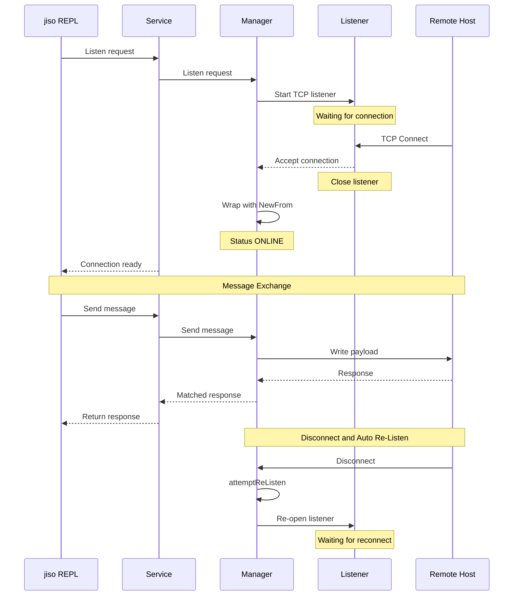

# Client Listener Mode Architecture & Usage Guide

## Overview

In traditional ISO8583 deployments, client applications establish outbound TCP connections to a payment switch (Caller Mode). However, in many payment network architecture topologies (e.g., POS terminal controllers, acquirer interfaces, or incoming network scheme drops), the remote switch or host initiates the TCP connection to the client application.

`jiso` supports **Client Listener Mode**. When operating in Listener Mode:
1. `jiso` acts as a TCP/mTLS listener waiting for a remote host to connect.
2. Once a connection is established, `jiso` wraps the socket as an ISO8583 client session.
3. `jiso` maintains its role as a active client — enabling operators and automated scenarios to send outbound messages (`send`, `bgsend`, `stress`, `run-scenario`) over the accepted connection.
4. Unsolicited incoming messages from the remote host can be parsed and automatically responded to using `mock_routes`.
5. If the remote host drops the TCP connection, `jiso` automatically re-opens the listener (Auto Re-Listen) to accept subsequent reconnections.

---

## Caller Mode vs. Listener Mode

| Mode | TCP Connection Setup | Initializer | Primary Use Case |
| :--- | :--- | :--- | :--- |
| **Caller Mode** | `jiso` dials remote IP:Port (`net.Dial`) | `jiso` | Connecting to a remote ISO8583 payment switch/host |
| **Listener Mode** | Remote host dials `jiso` IP:Port (`net.Listen`) | Remote Host | Accepting incoming switch connections while operating as client |
| **Mock Server (`serve`)** | Remote host dials `jiso` (`net.Listen`) | Remote Host | Fully automated mock server responding to all inbound requests via routes |

> **Key Distinction**: Unlike `serve` (which acts as a multi-client mock server), **Listener Mode** operates `jiso` as an active single-connection client session tied to the REPL, scenario runner, and stress testing workers.

---

## Sequence Diagram



---

## Configuration & CLI Flags

| Flag / Setting | Default | Description |
| :--- | :--- | :--- |
| `--listen-timeout <duration>` | `5m` | Maximum duration to wait for an incoming client connection before timing out |
| `--port` / `-p <port>` | `9999` | Target port to bind the TCP listener |
| `--tls-config <path>` | `""` | Optional TLS/mTLS JSON configuration file for encrypted listener sockets |

---

## Interactive REPL Usage

1. Launch `jiso` REPL:
   ```bash
   jiso -s specs/visa.json -f transactions/sample.json
   ```

2. Enter `connect`:
   ```text
   jiso> connect
   ? Select connection mode: Listener (Wait for incoming)
   ? Select length type: binary2
   ? Parse and process unsolicited incoming messages via mock_routes? Yes
   ? Enter port to listen on: 9999

   Listening on port 9999 (timeout: 5m0s)... Waiting for remote host to connect...
   ```

3. When the remote switch or host connects:
   ```text
   Accepted incoming connection from 192.168.1.50:54321 on port 9999
   Successfully accepted connection on port 9999! Client is now connected in listener mode.
   ```

4. Now execute commands as usual:
   ```text
   jiso> send 1
   jiso> stress 10 100
   jiso> run-scenario SanityCheck
   ```

5. To terminate the listener or connection, run `disconnect` or `exit`.

---

## Non-Interactive Programmatic API (Go)

```go
package main

import (
    "time"
    "jiso/internal/cli"
)

func main() {
    c := cli.NewCLI()
    if err := c.Prepare(); err != nil {
        panic(err)
    }

    // Start listener mode on port 9999 with binary2 length header
    if err := c.Listen("9999", "binary2"); err != nil {
        panic(err)
    }

    // Client is now connected to remote host via listener
    defer c.Close()
}
```

---

## Internal Code Structure

- [`internal/connection/manager_listen.go`](file:///Users/andrei/Developer/go/src/github.com/andrei-cloud/jiso/internal/connection/manager_listen.go): Implements `Listen()`, `attemptReListen()`, and listener timeout logic.
- [`internal/connection/manager_listen_test.go`](file:///Users/andrei/Developer/go/src/github.com/andrei-cloud/jiso/internal/connection/manager_listen_test.go): Unit tests covering listener lifecycle, message sending over accepted sockets, timeouts, and cancellation.
- [`internal/service/service.go`](file:///Users/andrei/Developer/go/src/github.com/andrei-cloud/jiso/internal/service/service.go): Service wrapper exposing listener controls.
- [`internal/command/connect.go`](file:///Users/andrei/Developer/go/src/github.com/andrei-cloud/jiso/internal/command/connect.go): REPL prompt integration for mode selection.
