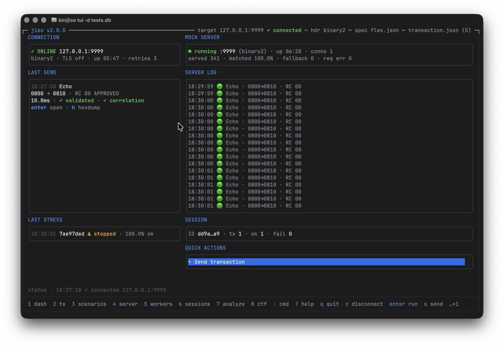

# JISO TUI — User Guide

`jiso tui` launches the full-screen (alternate-screen) Bubble Tea terminal UI:
one binary for connecting, sending, scenario runs, mock-server hosting,
stress workers, session review, PCAP analysis, and CTF export. This guide is
generated from the live §M help registry (`internal/tui/help_registry.go`);
every key it documents is bound.

## Visual tour

Real captures from a live session — a JISO client against JISO's own embedded
mock server on `127.0.0.1:9999`. The full guided tour (connect & send, host the
mock server, inspect a transaction, stress test, review sessions, analyze a PCAP,
export a CTF) is the **[User journeys](../README.md#user-journeys-in-action)**
section of the README.

<p align="center">
  
</p>

## Launching

```console
$ jiso tui
```

- Requires an interactive terminal (TTY) on stdin and stdout. Without one,
  jiso prints `jiso tui requires an interactive terminal (TTY); use the
  headless commands instead` to stderr and exits 2 — in CI or pipes use the
  headless commands (`jiso send`, `jiso scenario run`, `jiso stress`, …).
- Boot lands on the **status** page (dashboard). The terminal is restored by
  the Bubble Tea runtime on every exit path.
- Bare `jiso` never enters any interactive mode: it prints a usage hint and
  exits 0. The legacy line-oriented REPL was removed in v2.0.0; `jiso repl`
  now prints a removal notice to stderr and exits 2.

## Global chrome

- Header: `jiso <version> | <mode>` left, connection status right
  (`online` / `● ONLINE`), plus the spec / db / srv strip.
- Footer: the global legend (page jumps, then palette / help / quit) followed
  by context hints generated from the current page's keymap. Never hardcoded
  per page. One hotkey surface per state: while a keyboard-owning overlay
  lists its keys in-body (dialogs, forms, wizards, file picker, inline
  viewers) or documents every key in its box (help), the strip keeps the
  global legend only — and a pending confirm swaps its decision keys into it.
- Key glyphs in body text (empty-state hints, wizard footers, inline toggle
  notes) render bold-accent, matching the footer's accented keys, so an
  inline affordance reads as a hotkey at a glance.
- Modals (connect, forms, file picker, confirm, palette, help, error) render
  over the current page; while open they own the keyboard, so typing `q` or a
  digit into a field never quits or jumps pages. `ctrl+c` stays global.

## Page map

Hotkeys `1-8` replace the stack with the page; the remaining pages are
palette-only. Page IDs are the wire-compat slot names; the *Screen* column
names the screen from the wireframes (`.hermes/plans/wireframes-jiso-tui.md`).

| Hotkey | Page ID | Screen | Contents |
|---|---|---|---|
| `1` | `status` | Dashboard (§A) | Connection / server / session cards, last send & stress cards, quick actions, server log |
| `2` | `send` | Transactions (§B) | Tx table from the loaded tx file, filter and sort |
| `3` | `scenario` | Message Inspector (§C) | Fields tree, bitmap, packed hex, raw json tabs (opened by `enter` on a tx) |
| `4` | `server` | Mock Server (§G) | Serve stats, route table, live SERVER LOG, start form |
| `5` | `stress` | Workers & Stress (§H) | Worker table, TPS sparkline, per-worker progress |
| `6` | `db` | Sessions (§I) | Session list, stats, tx history, tx review |
| `7` | `analyze` | PCAP Analyze (§J) | 4-step wizard (capture/spec/header/run), flow table, report |
| `8` | `help` | Help (§M) | Full key registry as a page (same content as the `?` overlay) |
| — | `scenarios` | Scenarios (§F) | Scenario list, live step stream, report export |
| — | `ctf` | CTF Export (§K) | Visa-eligible sessions, CTF parameters, file preview |
| — | `settings` | Settings (§L) | Live config editor, `w` persists user defaults |
| — | `send-exchange` | Send exchange (§D) | Deep page opened by `s` on Transactions: request/response split |

Root-owned overlays (never pages in the stack): connect dialog (§E), command
palette, help overlay, file picker (§N1), start wizards (§N2), confirms (§N3),
error modal.

## Global keys

Evaluated before any page; a pending modal or a page-local text-input mode
(e.g. a live filter) claims keys first.

| Keys | Action |
|---|---|
| `1-8` | Jump to page N (replaces the stack; repeating the current page is a no-op) |
| `:` / `ctrl+p` | Open the command palette |
| `c` | Open the connect dialog (on the server page, opens the server start form instead) |
| `tab` / `shift+tab` | Cycle pane focus forward / back |
| `f9` | Toggle mouse reporting: with the mouse off the terminal regains native text selection; press again to restore wheel/click |
| `?` | Toggle the help overlay for the current page (`esc` also closes it) |
| `q` | Back (pop one page); at the root page it quits — with a confirm when workers are active |
| `ctrl+c` | Graceful exit from anywhere; the runtime restores the terminal |

`esc` unwinds one level everywhere: it closes an open modal first, and on
any other page it goes back — popped pages pop, hotkey-jumped pages
navigate home. `esc` on the dashboard is a no-op (`q` is the quit chord,
with its confirm). No page keeps `esc` for anything else.

`ctrl+z` and `ctrl+\` are deliberately unbound: the Bubble Tea runtime keeps
its signal behaviour for them.

## List navigation

Shared by the list pages (status feed, transactions, workers, server routes,
sessions, scenarios, ctf).

| Keys | Action |
|---|---|
| `up` / `k` | Move up |
| `down` / `j` | Move down |
| `pgup` | Page up |
| `pgdown` | Page down |
| `home` | Jump to top |
| `end` | Jump to bottom |

## Mouse

The mouse overlays the keyboard; it is not a command surface of its own.
Every gesture resolves to exactly the state change the keyboard path
makes — a resolved click replays the same dispatch the typed key would —
and no gesture is a bound key. That is why this section is prose: the
*Keys* tables in this guide stay exactly the §M registry's bound keys,
and nothing here adds a token to them.

- **Wheel** scrolls the pane under the cursor: the transactions and
  workers tables, the sessions list and the tx review window, the §G
  SERVER LOG, the §K records viewer, the §J generated-item roster and
  its file preview, and the §M help box. A notch steps the same window
  the page keys drive, clamped at both ends; horizontal wheel steps
  scroll nothing vertical. While a modal is open the wheel over the
  page behind it is inert — the modal owns the screen and the frozen
  page stays frozen — except over the §M box and the error modal's body,
  which scroll whenever they are open.
- **Click a row** to move the cursor to it: the transactions and
  workers tables, the sessions list and tx history, the §G routes
  pane, the §J generated-item roster, and the file picker's entries.
  A click only selects, exactly like the arrow keys — it never opens
  or toggles; `enter` and `space` still act. A file-picker row click
  additionally runs the picker's own selection: descend into a
  directory, or commit a selectable file into the field that opened
  it.
- **Click a footer hotkey** to fire that key at the cell its label is
  drawn in. The click dispatches through the same router as typing, so
  when a modal owns the keyboard the key reaches the modal. Entries the
  footer elided for width (the `…+N` tail) have no cell to click, and
  display-only legends (labels that spell no single key) fire nothing.
- **Click a form field or a wizard-rail step** to focus it. A field row
  (connect dialog, mock-server start form) takes field focus in
  navigate mode — typing still enters edit mode. A rail step walks the
  keyboard's own transitions. On the send and worker wizards earlier
  steps are free revisits, and a forward click replays the current
  step's `enter` leg with its validation — but only for the
  immediately next step; a larger forward gap is inert. The §J wizard
  rail follows its PgUp/PgDn shape instead: any forward click advances
  at most one gated step, and backward jumps stay free except while a
  write is in flight, when the rail notes the wait and stays put.
- Only the **left button** acts; middle/right clicks, releases, and
  pointer motion are ignored, so a click never double-fires.

The visible tradeoff: while the TUI owns the screen it captures the
terminal's mouse reports, so native text selection needs either a held
modifier or the toggle. Hold `shift` (most terminals) or `option`
(Terminal.app and iTerm2 defaults on macOS) while dragging to select and
copy without changing anything — or press `F9` to switch the mouse off
entirely: the TUI releases the terminal's mouse reporting, plain
click-drag selects text (test results, log lines) again, and every
wheel/click gesture is inert until `F9` re-arms it. The mouse is ON by
default; the dashboard footer advertises the key as `F9 select`, and the
`?` overlay lists it under *global*. Frames below the minimum width draw
the too-small notice with no live click zones at all.

## Page actions

### status — Dashboard

Information grid: CONNECTION, LAST SEND and LAST STRESS left; MOCK
SERVER, SERVER LOG, SESSION and QUICK ACTIONS right (single column on
narrow terminals). Card titles carry no key badges; empty states teach
the key (`no send yet · s sends`, `no stress run · t starts one`,
`○ stopped · 4 opens the server page` — a page jump; the start form
opens there — `no server output yet`). SESSION counters refresh on a
2 s tick that is dirtied by send completions and worker events; the DB
read never runs on the UI thread.

| Keys | Action |
|---|---|
| `enter` | Run the highlighted quick action (`View last send` reopens §D, `Stress summary` opens the run summary) |
| `D` | Disconnect — §N3 confirm while workers or the mock server run; sane no-op toast otherwise |
| `t` | Open the stress wizard — the same wizard §H's `t` opens |
| `esc` | No-op — the dashboard is home |

### send — Transactions

| Keys | Action |
|---|---|
| `enter` | Open detail (Message Inspector) |
| `s` | Open the send exchange for the selected tx |
| `f` | Pick a tx file (file picker) |
| `/` | Live filter (claims the keyboard; `esc` exits the filter first) |
| `o` | Cycle sort column |
| `esc` | Back |

### scenario — Message Inspector

| Keys | Action |
|---|---|
| `enter` | Expand composite field / compose with dataset |
| `left` | Collapse field |
| `right` | Expand field |
| `r` | Cycle the auto-value preview pool |
| `esc` | Back |

### stress — Workers & Stress

| Keys | Action |
|---|---|
| `b` | Open the background-send wizard |
| `t` | Open the stress wizard |
| `k` | Stop the selected worker |
| `K` | Stop all workers (§N3 confirm) |
| `enter` | Worker detail |
| `esc` | Back |

### server — Mock Server

Three columns while the server emits output: the compact STATS card, the
ROUTES table (MATCH/RESP/HITS; latency lives in the route detail), and
the SERVER LOG as the big right pane — root-timestamped, compacted
(`09:17:03 🟢 Echo · 0800→0810 · RC 00`), newest at the bottom.

| Keys | Action |
|---|---|
| `s` | Stop the server — confirms first while connections are live |
| `r` | Focus the routes list |
| `enter` | Open route detail |
| `j`/`k` | Scroll the SERVER LOG (with routes unfocused) |
| `G` / `end` | Resume following the newest log line |
| `esc` | Back |

### db — Sessions

| Keys | Action |
|---|---|
| `enter` | Open the session (stats + tx history) |
| `t` | Review the selected tx (reconstructed fields + packed hex) |
| `/` | Live filter |
| `r` | Reload sessions |
| `esc` | Back |

### analyze — PCAP Analyze wizard

Four steps — `capture` → `spec` → `header` → `run` — advanced with `enter`,
backed with `esc`, jumped with `pgup`/`pgdown`; `tab`/`shift+tab` revisit a
previous step. On the first three steps `j`/`k` move, `space` selects, `enter`
advances (capture and spec also take a typed path or `f` to browse — the
spec step's picker offers `.json` files, and `enter` on an empty spec keeps
the engine default).

On the **run** step the enumerated **dst** (request) and **src** (response) flow
rows are all cursor-reachable and each shows the peer port (`from`/`to` for
origin clarity); `space` toggles one **direction** independently — the analysis
unit is a flow direction, not the conversation port (requests/`dst` are selected
by default; scenario folds a port's two directions into one unit):

| Key | Action (run step) |
|---|---|
| `j` / `k` | Move the flow cursor across dst and src rows |
| `space` | Include / exclude that direction (dst and src toggle independently) |
| `a` | Include all / none |
| `t` / `r` / `s` | Goal: transactions / mock routes / scenario |
| `m` | Toggle PAN/track masking |
| `o` | Edit the output path |
| `u` | Open the unparsable-message reviewer (parsed fields + marked hexdump) |
| `enter` | Run the analysis |
| `w` | Write the selected generated items (§N3 overwrite confirm) |
| `esc` | Back a step · §N3 abort while a leg is in flight |

After a run the **generated-item picker** auto-presents: `space` toggles a row,
`a` all-or-none, `enter` applies the selection, `esc` applies it too and closes,
`x` reopens — a transaction and its dataset share a toggle group so they move
together, and `w` then writes exactly the selected set (no separate dry-run step;
an all-deselected picker is an error). `tab`/`shift+tab` move the picker focus
between the item list and the file-form **preview**; while the preview holds the
focus `j`/`k` scroll it and `PgUp`/`PgDn` page it when its content does not fit
(the title shows the visible window, e.g. `3-25/100`). The **unparsable viewer**
(`u`) is read-only: `j`/`k` walk samples, `PgUp`/`PgDn` page, `esc` closes.

### scenarios — Scenarios

| Keys | Action |
|---|---|
| `enter` | Run the selected scenario (steps stream live; failed steps show the validation diff) |
| `enter` | On a STEPS-pane row: preview the step's request/response message overlay |
| `j` / `k` | Move the STEPS-pane cursor (STEPS focused) / scroll the message preview (overlay open) |
| `tab` / `shift+tab` | Switch focus between the SCENARIOS list and the STEPS pane |
| `e` | Export the JSON report (§N3 overwrite confirm when the path exists) |
| `/` | Live filter |
| `esc` | Back (closes the message preview overlay first when it is open) |

### ctf — CTF Export

Two panes — **SESSIONS** (Visa tx-eligible sessions, `/` client-side filter) and
**PARAMETERS** (four rows: CIB / interchange BIN, filter card BIN, batch number,
output path).

| Keys | Action |
|---|---|
| `enter` | Generate the CTF from the selected session (live record preview) |
| `tab` / `shift+tab` | Switch pane · move the field-focus ring within PARAMETERS |
| `/` | Filter sessions |
| `r` | Reload eligible sessions |
| `w` | Write the CTF file (§N3 overwrite confirm when the path exists) |
| `esc` | Close the record preview · return focus to the list · back |

The record preview is read-only: `j`/`k` walk records, `PgUp`/`PgDn` page, and
`←`/`→` scroll the column window — records are wider than the terminal, and a
mainframe-style position ruler above the records marks the visible column range
(a digit every 10 columns, `+` at half-decades).

### settings — Settings

| Keys | Action |
|---|---|
| `enter` | Edit the selected field |
| `w` | Save to the user config (confirm overlay) |
| `r` | Reload the config |
| `f` | Pick a file (file picker) |
| `esc` | Discard edits / back |

### help — Help page

Carries only the global keys — the registry content it renders is available
on every page as the `?` overlay.

### send-exchange — Send exchange (deep page)

Opened by `s` on Transactions; shows request/response with a segmented stage
indicator (no auto-retry; timeouts show `✗ TIMEOUT`).

| Keys | Action |
|---|---|
| `enter` | Send again |
| `h` | Toggle hexdump |
| `esc` | Back |

## Command palette

`:` or `ctrl+p` opens the palette on any page. It fuzzy-matches the first
word of the line; trailing tokens are shell-quoted args
(`:send --flag value`). While open the palette owns the keyboard wholesale.

| Chord | Action |
|---|---|
| `esc` | Close the palette |
| `enter` | Run the selected action (zero matches: no-op, stays open) |
| `backspace` | Delete one character |
| `up` / `k`, `down` / `j` | Move the selection |

Registered commands: `connect`, `disconnect`, `goto status`, `goto send`,
`goto scenario`, `goto stress`, `goto server`, `goto db`, `goto analyze`,
`goto help`, `goto scenarios`, `goto ctf`, `goto settings`, `help`
(pushes help, keeping context), `quit`.

## Dialogs, forms, and confirms (§N2/§N3)

The connect dialog (`c`) is a modal form: `tab` / `shift+tab` move field
focus, `up`/`k` and `down`/`j` navigate choices, `enter` starts the attempt
loop, `esc` cancels (in flight it also aborts the attempt). It is a
two-mode form: typing into a field enters edit mode, where every key is
literal (`f` and `q` included); `esc` then leaves the field first, and the
next `esc` cancels the dialog. Fields
enable/disable by mode and header type (station ID only for `visa`).

The §N1 file picker (spec / tx / pcap / output paths): `up`/`k`,
`down`/`j` navigate, `/` filters, `h` toggles hidden files, `u` or
`backspace` goes up a directory (a `..` row always leads the list of a
climbable directory, and the pickers start at the current file's
directory but climb the whole filesystem from there), `backspace` also
deletes typed filter text, `enter` selects, `esc` cancels.
It remembers the last directory per file type.

The background-send (`b`) and stress (`t`) starts are three-step wizards —
`1 tx ▸ 2 params ▸ 3 run` and `1 tx ▸ 2 rate ▸ 3 run`. The tx step is a
scrollable list window with five visible transactions at a time: the `▸`
cursor auto-scrolls the window and the `▴ n above` / `v n below` marker
lines name the hidden rows, `/` filters, `space` toggles rows (stress
multi-select with a selected count) or `enter` picks one (background
send), and `f` opens the §N1 file picker over `.json` tx files — the pick
reloads the list and keeps selections whose names still exist. The middle
step takes the parameters as label + input rows (one focused row at a
time, `up`/`down` moves focus) with inline validation; `enter` advances
only when every value is valid. The wizards are two-mode forms like the
dialog above: a step starts in navigate mode (`?` opens the §M help
overlay there), typing enters edit mode where every key is literal, and
`esc` leaves the row or filter before a later `esc` backs the step. The
run step summarizes the selection and
parameters; `enter` starts, `esc` backs one step (closing from the first).

When a stress run finishes (or its row is inspected), the §H page shows
the STRESS SUMMARY overlay: the worker id with its status and ok-ratio,
a RUN box (transactions, target, plan, runtime with actual and peak TPS,
sent/ok/fail), LATENCY MS (min/mean/max and p50/p90/p95/p99 plus the
latency budget classification), RESPONSE CODES with per-code shares
beside the latency HISTOGRAM, and the PER TRANSACTION breakdown
(ok/err, mean, p99, response codes per transaction type). `esc` closes
it and returns to the worker table.

The mock-server start form (§G, opened by `c` on that page) takes
parameters as label + input rows with inline validation; `enter` submits,
`esc` cancels. It is a two-mode form: while nothing is typed, `f` on the
spec-file or routes-file row opens the §N1 file picker (`.json`); typing
into a row enters edit mode, where `f` types literally and `esc` leaves
the row before a later `esc` cancels the form. The form carries no
fabricated defaults: the fields prefill from
the last successful start (remembered in the state dir), the config fills
the spec and routes rows until a start has ever run, and an unselected
header radio falls back to `binary2` only when `enter` starts the server.
The pick lands in that row and the other fields keep their edits.

The mock server's own output (route-match and error notices) renders ONLY
in the §G page's LOG pane, below the stats card — it never appears on
other pages.

§N3 confirms are for destructive or overwriting actions only, and the
default answer is always **No**:

| Chord | Effect |
|---|---|
| `y` | Confirm (proceed) |
| `n`, `esc`, `enter` | Cancel — the default |

Everything else is swallowed while a confirm is pending (page jumps
included). While one is pending the box only asks its question: the
decision keys (`y confirm`, `n cancel`, `esc cancel`) badge the footer
strip next to the global legend, and the page's own context hints stay
dropped until the answer lands. Confirms fire on: quit with active workers, stop all workers,
disconnect while workers or the mock server run, mock-server stop with live
connections, analyze abort over an in-flight step, analyze / scenario-export
/ CTF overwrite of an existing path, and settings save.

## Error modal

A failed action that would otherwise leave the screen with nothing to show
opens a modal box over the current page carrying the whole error: a long
line wraps at the box's inner width, and a longer body pages **ten lines at
a time**. While it is open it owns the keyboard — the page below stays
frozen, page jumps included — its keys ride the footer next to the global
legend, and a click on dead space outside the box closes it.

| Keys | Action |
|---|---|
| `enter` | Acknowledge and close |
| `esc` | Close |
| `j` / `k` | Scroll the body one line down / up |
| `pgdown` / `pgup` | Scroll the body ten lines down / up |

Every other key is swallowed while the box is open; `ctrl+c` stays the
graceful exit. A nil or empty error renders the honest `unknown error`
under the title instead of an empty box.

## Data masking

Every parsed/display surface is masked; the packed wire dump is not. The
contract, quoted from `internal/tui/root_inspector_state.go`:

> Masking contract (E5-A5): every PARSED/DISPLAY surface is masked
> root-side before it crosses to a page — the §C fields tree, its
> auto-preview pool, composite subfields, the §D pane rows (display AND
> hex), and the §C raw-json tab's parsed view. The PACKED WIRE DUMP is
> raw BY DESIGN (InspectorState.PackedHex / the view's packed_hex): it
> is the on-the-wire bytes, identical to `jiso inspect --json`, and
> masking it would defeat the tool's purpose.

## Exit behaviour

- `q` pops one page. At the root page with active workers it opens the §N3
  confirm `quit with N active worker(s)?` (default No: `y` quits,
  `n` / `esc` / `enter` stay). At the root page with no workers it quits
  directly.
- `ctrl+c` always exits gracefully, even inside a modal or while work is in
  flight; the runtime restores the terminal.
- `ctrl+z` / `ctrl+\` keep the runtime's signal behaviour (unbound).

## Parity with the live registry

The §M registry (and therefore this guide) is pinned by
`internal/tui/help_test.go` against `testdata/help/registry_dump.golden`,
and `internal/tui/docs_tui_parity_test.go` checks every key token in this
guide's *Keys* tables against that dump: a doc key that isn't bound is a
bug and fails the test.
